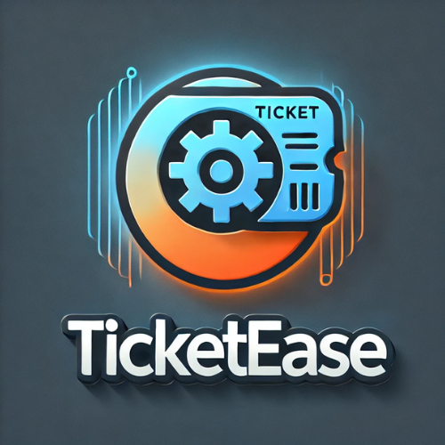

# 🛠️ TicketEase - Facilitando o Suporte Técnico com Eficiência e Simplicidade

<p align="center">
  
</p>

**TicketEase** é uma aplicação web projetada para otimizar o registro e gerenciamento de chamados técnicos. Com uma interface acessível e intuitiva, o sistema permite que usuários relatem problemas rapidamente, conectando-os ao suporte técnico de maneira eficaz.

---

## ✨ Funcionalidades Principais

- **📋 Abertura de Chamados**  
  Formulário moderno para cadastrar solicitações de suporte, incluindo:  
  - Dados pessoais (CPF ou CNPJ, Nome, Email).  
  - Motivo do chamado (opções pré-definidas como *"Sistema Inoperante"*, *"Telefone Mudo"*, etc.).  

- **✅ Validação de CPF**  
  Garantia de entrada correta com verificação automática de 11 dígitos numéricos.

- **📱 Design Responsivo**  
  Layout adaptado para diferentes tamanhos de dispositivos, de desktops a smartphones.

- **🔄 Redirecionamento com Confirmação**  
  Após o registro, uma mensagem de sucesso é exibida antes de retornar à página inicial.

---

## 🚀 Tecnologias Utilizadas

- **HTML5**: Para a estrutura do conteúdo.  
- **CSS3**: Para o design responsivo e elegante, com animações dinâmicas.  
- **JavaScript**: Para validações e interatividade no formulário.  

---

## 🖥️ Demonstração

Acesse a página **"Abra seu Chamado"** em [page2.html](./page2.html) e experimente o processo completo de abertura de um ticket, incluindo preenchimento e envio.

---

## 📂 Estrutura de Arquivos

```plaintext
/ 
├── index.html        # Página inicial
├── page2.html        # Formulário de abertura de chamados
├── styles.css        # Estilo da aplicação
├── script.js         # Funcionalidades interativas
└── assets/           # Imagens e outros recursos


